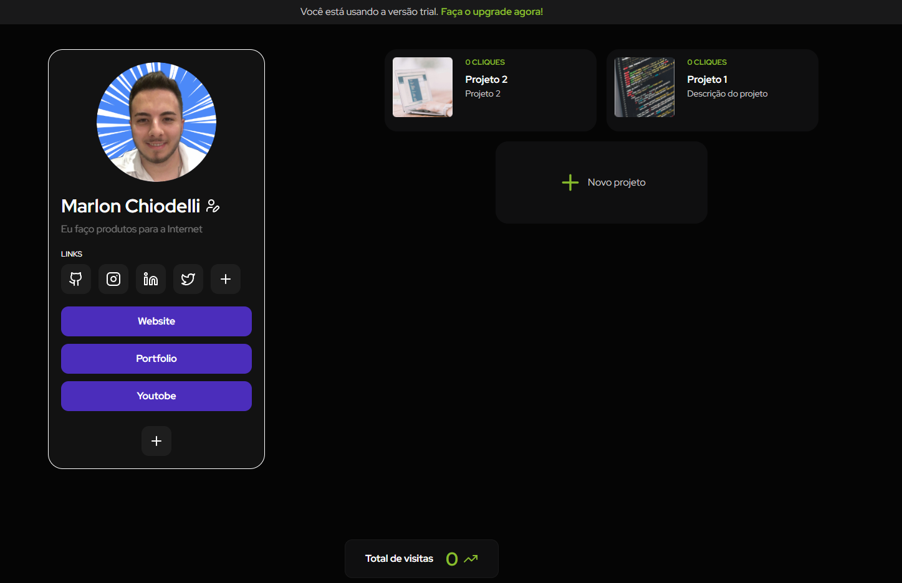

# ProjectInBio

Project In Bio é um Micro Saas desenvolvido para o usuário adicionar redes sociais, websites e projetos e assim ter seu portfolio online.
O checkout para assinaturas contém dois planos, mensal e vitalício onde é realizado o pagamento via Stripe.

## Tech Stack
- React/NextJs
- typescript
- firebase
- next auth
- stripe
- tailwindcss
- supertest
- Docker
- Postgres
  
## Screenshots

  

